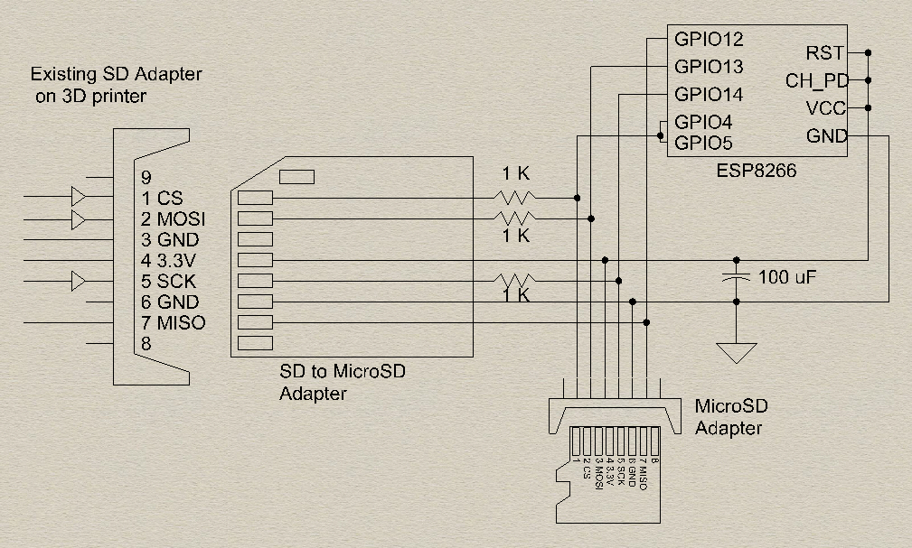

# WebDAV Server and a 3D Printer
WebDAV-Server und ein 3D-Drucker
Dieses Projekt ist ein WiFi-WebDAV-Server mit ESP8266 SoC. Es verwaltet das Dateisystem auf einer SD-Karte.

Unterstützt die grundlegenden WebDav-Operationen - *PROPFIND*, *GET*, *PUT*, *DELETE*, *MKCOL*, *MOVE* usw.

Sobald der WebDAV-Server auf dem ESP8266 läuft, kann ein WebDAV-Client wie Windows wie auf ein Cloud-Laufwerk auf das Dateisystem auf der SD-Karte zugreifen.
Das Laufwerk kann auch wie ein Netzwerklaufwerk gemountet werden und ermöglicht das Kopieren/Einfügen/Löschen von Dateien auf der SD-Karte aus der Ferne. 

### 3D Drucker

Ich verwende dieses Setup als Netzwerklaufwerk für 3D-Drucker mit Marlin. Die folgende Schaltung mit ESP8266 und einem MicroSD-Adapter wird auf einer Leiterplatte hergestellt.
Ein SD-Kartenadapter in voller Größe wird an ein Ende geklebt und bietet Zugriff auf alle SPI-Datenleitungen vom Drucker. 
Der ESP8266-Code vermeidet den Zugriff auf die Micro-SD-Karte, wenn Marlin (Drucker-Firmware) darauf liest/schreibt (erkannt über die Chip-Select-Leitung).  

GCode kann direkt vom Slicer (Cura) auf dieses Remote-Laufwerk hochgeladen werden, wodurch der Arbeitsablauf vereinfacht wird.



## Abhängigkeiten:  
1. [ESP8266 Arduino Core version 2.4](https://github.com/esp8266/Arduino)
2. [SdFat library](https://github.com/greiman/SdFat)
  
## Use:

### Compile and upload

#### Compile

If you don't want to update the firmware. You don't need to do this. Compile and upload the program to an ESP8266 module. 

- Open the project
  
  Download this project and open it with [arduino](https://www.arduino.cc/) software.

- Add board manager link
  
  Add boards manager link: `https://arduino.esp8266.com/stable/package_esp8266com_index.json` to File->Preferences board manager, Documentation: https://arduino-esp8266.readthedocs.io/en/2.7.1/ 

- Select board
  
  Select Tools->boards->Generic ESP8285 Module.

- Click the Arduino compile button

#### Upload

1. Pulg in the USB cable to your computer
2. Diag the switch on the module to `USB2UART`
3. Press and hold the module FLSH 
4. Connect the USB cable to the module
5. Release the module FLSH button
6. Click the Arduino upload button

### Config

First you can see our video [here](https://www.youtube.com/watch?v=YAFAK-jPcOs). You have two ways to config the module.

*note: The card should be formatted for Fat16 or Fat32*

#### Option 1: INI file

You can edit the example ```SETUP.INI``` file in ```ini``` folder, change the SSID and PASSWORD value. And then copy ```SETUP.INI``` file to your root SD card. Then insert it to the module. 

1. Turn the module option button to ```USB2UART``` 
2. Open a COM software in your computer
3. Connect the module to your computer with USB cable
4. Open the software COM port

you can see the module IP and other information.

*note: if you miss the serial output, you can click the ```RST``` button in the module.*

#### Option 2 : Command

Insert your sdcard to the module.

1. Turn the module option button to ```USB2UART``` 
2. Open a COM software in your computer
3. Connect the module to your computer with USB cable
4. Open the software COM port

And use the following command to connect the network or check the network status

    M50: Set the wifi ssid , 'M50 ssid-name'
    M51: Set the wifi password , 'M51 password'
    M52: Start to connect the wifi
    M53: Check the connection status

### Access

#### windows

To access the drive from Windows, type ```\\ip\DavWWWRoot``` at the Run prompt, this will show in serial output as our [video](https://www.youtube.com/watch?v=YAFAK-jPcOs) shows.

Or use Map Network Drive menu in Windows Explorer.

#### MAC

Just need to use  ```http://192.168.0.x``` in access network drive option

## References

Marlin Firmware - [http://marlinfw.org/](http://marlinfw.org/)   

Cura Slicer - [https://ultimaker.com/en/products/ultimaker-cura-software](https://ultimaker.com/en/products/ultimaker-cura-software)   

3D Printer LCD and SD Card Interface - [http://reprap.org/wiki/RepRapDiscount_Full_Graphic_Smart_Controller](http://reprap.org/wiki/RepRapDiscount_Full_Graphic_Smart_Controller)   

LCD Schematics - [http://reprap.org/mediawiki/images/7/79/LCD_connect_SCHDOC.pdf](http://reprap.org/mediawiki/images/7/79/LCD_connect_SCHDOC.pdf)   
