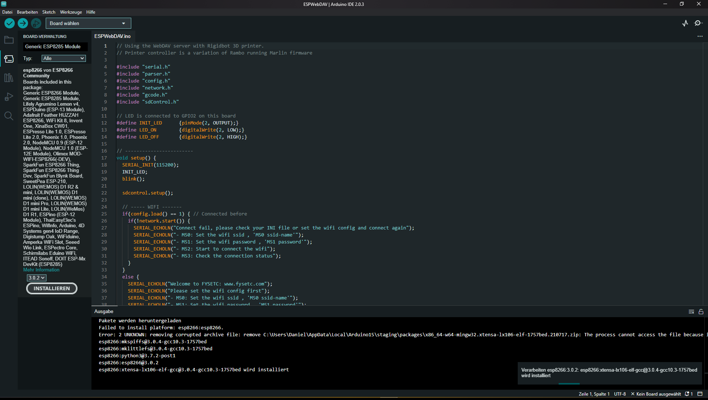

## WebDAV-Server und ein 3D-Drucker
[ESP8266 Programmer Sockel Downloader Für ESP-07 ESP-12F ESP-12S](https://arduino-projekte.info/produkt/esp8266-programmer-sockel-downloader-fuer-esp-07-esp-12f-esp-12s/)
[ESP-12S ESP8266 WiFi Modul](https://arduino-projekte.info/produkt/esp-12s-esp8266-wifi-modul/)
[SD-WIFI mit SD reader Modul, Drahtlose Übertragung Modul für S6 F6, Raspberry](https://www.amazon.de/-/en/reader-module-wireless-transmission-Raspberry/dp/B091HXS8XM/ref=sr_1_5?crid=3JY3ZWGEJVMDF&keywords=fysetc+wifi&qid=1671769092&sprefix=fysetc+wifi%2Caps%2C213&sr=8-5)

https://www.amazon.com/-/de/dp/B0B8SDH4ZK/ref=sr_1_11?__mk_de_DE=%C3%85M%C3%85%C5%BD%C3%95%C3%91&crid=28FPBGNBOEDGX&keywords=fysetc+wifi&qid=1671768758&sprefix=fystec+wifi%2Caps%2C179&sr=8-11
[YouTube Suche: fysetc sd-wifi setup](https://www.youtube.com/results?search_query=fysetc+sd-wifi+setup+ "fysetc sd-wifi setup")  


***** [YouTube: fysetc sd-wifi setup](https://www.youtube.com/watch?v=WnQ7pxHB7hs&t=298s "fysetc sd-wifi setup")  
[YouTube: fysetc sd-wifi setup](_Video/FYSETC_How_to_upgrade_SD_Wifi_module_firmware.mp4 "")


[YouTube: FYSETC SD Wifi Wireless Transmission Module Introduction](https://www.youtube.com/watch?v=2aW-65--NJk "FYSETC SD Wifi Wireless Transmission Module Introduction") 
Das originale [Repository auf GitHub](https://github.com/ardyesp/ESPWebDAV "Das original Repository auf GitHub"). 
Die Software des vorherigen Videos kann man hier downloaden und stellt eine [andere Version zu Pronterface für Windows 10: sscom5.12.1.exe, sscom51.ini](https://github.com/FYSETC/sscom "original Download von Fysetc") da, mit weiteren Testmöglichkeiten. 
Die Bedienungsanleitung zu [sscom.vip](http://www.sscom.vip/) ist dortig. 

[YouTube: SD Card + ESP8266 = OctoPrint Alternative?](https://www.youtube.com/watch?v=nHNZPRl8gzA&t=566s "YouTube: SD Card + ESP8266 = OctoPrint Alternative?")  
[Kaufen: FYSETC SD Wifi Wireless Transmission Module + ESP8266](https://www.fysetc.com/collections/other-modules/products/fysetc-sd-wifi-with-card-reader-module-run-espwebdev-onboard-usb-to-serial-chip-wireless-transmission-module-for-s6-f6-turbo?variant=37578391027887)

Dieses Projekt ist ein WiFi-WebDAV-Server mit ESP8266 SoC. 
Es verwaltet das Dateisystem auf einer SD-Karte.

Unterstützt die grundlegenden WebDav-Operationen - *PROPFIND*, *GET*, *PUT*, *DELETE*, *MKCOL*, *MOVE* usw.

Sobald der WebDAV-Server auf dem ESP8266 läuft, kann ein WebDAV-Client wie Windows wie auf ein Cloud-Laufwerk auf das Dateisystem auf der SD-Karte zugreifen.
Das Laufwerk kann auch wie ein Netzwerklaufwerk gemountet werden und ermöglicht das Kopieren/Einfügen/Löschen von Dateien auf der SD-Karte aus der Ferne. 

### 3D Drucker

Ich verwende dieses Setup als Netzwerklaufwerk für 3D-Drucker mit Marlin. 
Die folgende Schaltung mit ESP8266 und einem MicroSD-Adapter wird auf einer Leiterplatte hergestellt.
Ein SD-Kartenadapter in voller Größe wird an ein Ende geklebt und bietet Zugriff auf alle SPI-Datenleitungen vom Drucker. 
Der ESP8266-Code vermeidet den Zugriff auf die Micro-SD-Karte, wenn Marlin (Drucker-Firmware) darauf liest/schreibt (erkannt über die Chip-Select-Leitung).  

GCode kann direkt vom Slicer (Cura) auf dieses Remote-Laufwerk hochgeladen werden, wodurch der Arbeitsablauf vereinfacht wird.


## Abhängigkeiten:  
1. [ESP8266 Arduino Core version 2.4](https://github.com/esp8266/Arduino)
2. [SdFat library](https://github.com/greiman/SdFat)
3. [ESPWebDAV](https://github.com/d-a-v/ESPWebDAV)
  

## Vorab Testen

Man kann den Quellcode auch einfach auf eine mSD kopieren und einlegen. 
Dieser wird dann auch weitreichend funktionieren, allerdings funktioniert dadurch der WebDav-Server nicht richtig, WLan funktioniert schon irgendwie. 
Man kann allerdings keine Dateien auf die mSD über die WiFi (WLan-) Verbindung kopieren oder löschen. 
Im Browser erhält man den Fehler ""Failed to initialize SD Card"", wie auch im Drucker. 

Um die ordendliche Installation vorzunehmen, sehen Sie sich dieses Video an. 
Es wurde oben schon einmal angegeben und befindet sich im Download.  
[YouTube: fysetc sd-wifi setup](_Video/FYSETC_How_to_upgrade_SD_Wifi_module_firmware.mp4 "")  
[YouTube: fysetc sd-wifi setup](https://www.youtube.com/watch?v=WnQ7pxHB7hs&t=298s "fysetc sd-wifi setup")  

## Verwendung  :
Kompilieren Sie das Programm und laden Sie es in ein ESP8266-Modul hoch. 
ESP12-E wurde für Entwicklung und Tests verwendet.
Verbinden Sie die SPI-Busleitungen mit der SD-Karte.  

[Programming ESP-12E / ESP-12F / NodeMCU With Arduino IDE | Step by Step Guide](https://www.youtube.com/watch?v=_iX67plFeLs)  
[Programming ESP-12E / ESP-12F / NodeMCU Over Wi-Fi](https://www.youtube.com/watch?v=3XyaDyu8UDw)  
[ESP12E, Einstieg mit dem ESP8266 Modul](https://www.mikrocontroller-elektronik.de/esp12e-tutorial-einstieg-mit-dem-esp8266-modul/)  
https://www.google.com/search?q=esp-12e+programming&oq=ESP-12E+&aqs=chrome.2.69i57j0i512l4j0i30i625l2j69i61.27801j0j7&sourceid=chrome&ie=UTF-8  


ESP Module|SD Card
---|---
GPIO13|MOSI   
GPIO12|MISO   
GPIO14|SCK    
GPIO4|CS   
GPIO5|CS Sense   

Die Karte sollte für Fat16 oder Fat32 formatiert sein.  

Um von Windows aus auf das Laufwerk zuzugreifen, geben Sie  in der Eingabeaufforderung „Ausführen“ ```\\esp_hostname_or_ip\DavWWWRoot``` ein oder verwenden Sie das Menü „Netzlaufwerk verbinden“ im Windows Explorer.

Der original Name des esp_hostname lautet: http://fysetc/DavWWWRoot


### Kompilieren und hochladen

#### Kompilieren

Wenn Sie die Firmware nicht aktualisieren möchten. 
Sie müssen dies nicht tun. 
Kompilieren Sie das Programm und laden Sie es in ein ESP8266-Modul hoch.

- Öffnen Sie das Projekt
  
   Laden Sie dieses gesamte Projekt herunter und öffnen Sie das Projekt aus dem Verzeichnis `ESPWebDAV-fysetc` die Datei `ESPWebDAV.ino` mit der Software von [arduino](https://www.arduino.cc/). 
   Ändern Sie die `SETUP.INI` wie nachfolgend beschrieben. 
   
   SSID=xxxx
   PASSWORD=xxxx

- Board-Manager-Link hinzufügen
  
   Boardmanager-Link hinzufügen: `https://arduino.esp8266.com/stable/package_esp8266com_index.json` zu File->Preferences und dirt bei Boardmanager, Dokumentation: https://arduino-esp8266.readthedocs.io/en/2.7.1/
   Dort wo `Zusätzliche Boardverwalter-URLs:` steht.

- Board auswählen
  
   Wählen Sie Tools->Boards->Alle und geben in die Suchleiste `Generic ESP8266 Module` ein und klicken dann unten auf den installieren-Button.
	
- Klicken Sie auf die Arduino-Kompilierungsschaltfläche


- In der Board Verwaltung geben sie `ESP8266 Community` ein und installieren die Version 2.4.0. 
- Im Bibleotheksverwalter geben Sie `sdFAT` von Bill Greiman ein und installieren Version 1.1.0 wenn möglich. 
- Unter Werkzeuge gehen Sie auf `Board: "Generic ESP8266 Module"` gehen dort zu `ESP8266` und wählen `Generic ESP8266 Module` aus. 
- Unter Werkzeuge gehen Sie auf `IwIP Variant` und wählen dort `v2 higher Bandwidth` für eine höhere Bandbreite des Netzwerks. 
- Unter Werkzeuge gehen Sie auf `Port` und verbinden Ihre ESP bitte mit dem richtigen COM-Port, meißt ist dort nur einer bzw. zwei verfügbar. 
  (Faustformel hierzu: ESP einstecken und herrausziehen, verrät welcher COM-Port einzustellen und zu nutzen ist. Anssonsten mal einen anderen USB-Port versuchen oder übrige USB-Geräte vom PC entfernen.)

## Kompilerungsfehler: 
Diese sind in der Regel das Ergebnis, weil man die Daten einfach nur auf die mSD kopierte.... 
Dies geht nicht so...

##### Dateifehler  ESPWebDAV.h`  
missing file error "cannot find ESPWebDAV.h", even though it is in the compiling folder.  
The version of esp8266 in the board manager needs to be 2.4. 
And clean up your output folder.   

fehlender Dateifehler "kann ESPWebDAV.h nicht finden", obwohl es sich im Kompilierungsordner befindet.  
Die Version von esp8266 im Boardmanager muss 2.4 sein. 
Und bereinigen Sie Ihren Ausgabeordner. 


##### Kompilierungsfehler: `ESPWebDAV.h`
Compilation error: ESPWebDAV.h: No such file or directory  
Kompilierungsfehler: ESPWebDAV.h: Keine solche Datei oder Verzeichnis. 
https://www.facebook.com/groups/197476557529090/posts/619035958706479/
https://github.com/Aircoookie/Espalexa/issues/40
[2 Easy fixes to Arduino error: “.h: No such file or directory"](https://www.youtube.com/watch?v=igdBT0hwsJc)

Um Kompilierungsfehler zu entgehen, sehen sie sich das [Youtube: 2 Easy fixes to Arduino error: “.h: No such file or directory"](https://www.youtube.com/watch?v=igdBT0hwsJc&t=47s "2 Easy fixes to Arduino error: “.h: No such file or directory") an. 

##### Fehlgeschlagenes Hochladen
FatalError('Failed to connect to %s: %s' % (self.CHIP_NAME, last_error))
esptool.FatalError: Failed to connect to ESP8266: Timed out waiting for packet header

Fehlgeschlagenes Hochladen: Hochladefehler: exit status 1
Sollte noch ein Uploadfehler erscheien, dann haben Sie die FLSH Taste sicherlich vergessen zu drücken. 


#### Weitere Fehlermeldungen auf: 
https://github.com/ardyesp/ESPWebDAV/issues
https://github.com/FYSETC/FYSETC-SD-WIFI/issues

#### Einfache Lösung

Sinvoll bei dem Kompilieren (auch wenn nur zum Testen alles auf die mSD zuvor kopiert [alles davon löschen]), es soll schon zuvor die ESP an dem richtigen COM-Port angeschlossen sein. 
Dann sollte es auch mit dem Kompilieren erfolgreich funktionieren und die vorherigen Fehler werden ausgeschlossen sein. 
Und die FLSH Taste an der ESP sicherlich vergessen zu drücken, soblad diese an den PC angesteckt wird. 


#### Hochladen

1. Stecken Sie das USB-Kabel in Ihren Computer
2. Stellen Sie den Schalter am Modul auf „USB2UART“.
3. Halten Sie das Modul FLSH gedrückt
4. Verbinden Sie das USB-Kabel mit dem Modul
5. Lassen Sie die FLSH-Taste des Moduls los
6. Klicken Sie auf die Arduino-Upload-Schaltfläche
7. Zum Schluß und nach erfolgreichem Upload, verlangt die Arduino IDE, das man den Hart-Reset-Taste (RST) auf der ESP (neben der FLSH-Taste) drückt und dann die Karte vom PC entfernt. 
8. Stellen Sie den Schalter am Modul auf „CARDREADER“.

### Konfiguration

Zuerst können Sie unser Video [hier](https://www.youtube.com/watch?v=YAFAK-jPcOs) oder [hier](https://www.youtube.com/watch?v=2aW-65--NJk&t=8s) sehen. 
Sie haben zwei Möglichkeiten, das Modul zu konfigurieren.

*Hinweis: Die Karte sollte für Fat16 oder Fat32 formatiert sein*

#### Option 1: INI-Datei

Sie können die Beispieldatei ```SETUP.INI``` im Ordner ```ini``` bearbeiten, den SSID- und PASSWORD-Wert ändern. 
Kopieren Sie dann die Datei „SETUP.INI“ auf Ihre Root-SD-Karte. Stecken Sie es dann in das Modul.

1. Drehen Sie den Optionsschalter des Moduls auf ```USB2UART```
2. Öffnen Sie eine COM-Software auf Ihrem Computer
3. Schließen Sie das Modul mit einem USB-Kabel an Ihren Computer an
4. Öffnen Sie den COM-Port der Software

Sie können die Modul-IP und andere Informationen sehen.

*Hinweis: Wenn Sie die serielle Ausgabe vermissen, können Sie im Modul auf die Schaltfläche „RST“ klicken.*

#### Option 2 : Befehl

Legen Sie Ihre SD-Karte in das Modul ein.

1. Drehen Sie den Optionsschalter des Moduls auf ```USB2UART```
2. Öffnen Sie eine COM-Software auf Ihrem Computer
3. Schließen Sie das Modul mit einem USB-Kabel an Ihren Computer an
4. Öffnen Sie den COM-Port der Software

Verwenden Sie den folgenden Befehl, um eine Verbindung zum Netzwerk herzustellen oder den Netzwerkstatus zu überprüfen

     M50: Stellen Sie die WLAN-Ssid ein, 'M50 ssid-name'
     M51: Stellen Sie das WLAN-Passwort ein, 'M51-Passwort'
     M52: Starten Sie die WLAN-Verbindung
     M53: Überprüfen Sie den Verbindungsstatus

### Zugang

#### Fenster

Um von Windows aus auf das Laufwerk zuzugreifen, geben Sie ```\\ip\DavWWWRoot``` am Run-Prompt ein, dies wird in der seriellen Ausgabe als unser [video](https://www.youtube.com/watch?v=YAFAK-jPcOs) zeigt.

Oder verwenden Sie das Menü Netzlaufwerk verbinden im Windows Explorer.

#### MAC

Sie müssen nur ```http://192.168.0.x``` in der Option für den Zugriff auf das Netzwerklaufwerk verwenden


## Verweise
Marlin Firmware - [http://marlinfw.org/](http://marlinfw.org/)   

Cura Slicer - [https://ultimaker.com/en/products/ultimaker-cura-software](https://ultimaker.com/en/products/ultimaker-cura-software)   

3D Printer LCD and SD Card Interface - [http://reprap.org/wiki/RepRapDiscount_Full_Graphic_Smart_Controller](http://reprap.org/wiki/RepRapDiscount_Full_Graphic_Smart_Controller)   

LCD Schematics - [http://reprap.org/mediawiki/images/7/79/LCD_connect_SCHDOC.pdf](http://reprap.org/mediawiki/images/7/79/LCD_connect_SCHDOC.pdf)   


## Das Video ist auf Youtube
[YouTube: SD Card + ESP8266 = OctoPrint Alternative?](https://www.youtube.com/watch?v=nHNZPRl8gzA&t=620s "") bei 5:54 beschreibt `Thomas Sanladerer` das WiFi-Setup. 
Er verwendet dazu: [FYSETC/ESPWebDAV](https://github.com/FYSETC/ESPWebDAV "") und dies stellt einen Clone vom Original [ardyesp/ESPWebDAV](https://github.com/ardyesp/ESPWebDAV "") da.


Ab 6:20 min. beschreibt er, das er dazu [Pronterface](https://www.google.com/search?q=pronterface+download&oq=Pronterface&aqs=chrome.1.69i57j0i512l9.3406j0j7&sourceid=chrome&ie=UTF-8 "") und dies ist eine [Pronterface: Printrun: Pure Python 3d printing host software](https://www.pronterface.com/ "") verwendet. 
Für Pronterface gibt es eine weitere Beschreibung [Pronterface: How to Download, Install & Set It Up - All3DP](https://all3dp.com/2/pronterface-how-to-download-install-and-set-it-up/ "").

## kurze Anleitung: 

Schritt: Wenn Du einen mSD-Adapter nutzen möchtest, so brauchst Du nur Schritt 3 zu befolgen. 
Und kopierst die Dateinen auf die mSD in das Stammverzeichnis. 

Schritt: Wenn Du keinen mSD-Adapter nutzen möchtest.
Am Gehäusebefindet sich ein kleiner Schalter. 
Siehe dies im Video bei 6.00 min. 
Stelle diesen auf "Cardreader" und lege eine mSD ein, wie im Video zu sehen. 
Verbinde nun den Stick mit dem Computer per USB Kabel. 

Schritt: Kopiere nun die Dateien von [FYSETC/ESPWebDAV](https://github.com/FYSETC/ESPWebDAV "") in das Stammverzeichnis auf die mSD. 

Schritt: Das WLan und das Passwort einrichten. 
Öffne und editiere die Datei `Setup.ini` im Verzeichnis `ini`. 
Ersetze dort die XXXXX mit deinem Wlan und bei Password den Netzwerkschlüssel und speichere die Datei auf dem USB-Stick ab. 

Entferne nun durch sicheres entfernen den USB-Stick aus dem Computer. 

Schritt: Nur erfoderlich, wenn man Pronterface testen möchte. 
Stelle nun den Schalter auf `USB2UART` am USB-Stick um. 
Stecke den Stick wieder ein. 

Schritt: Nicht erfoderlich aber hilfreich: Nun öffne die Systemsteuerung und dort öffne den Geräte-Manager. 
Unter `Anschlüsse (COM & LTP) findest Du diesen neuen Stick. 
Falls nicht, zieh diesen Stick ab und steck diesen erneut wieder ein. 
Bei mir erschien das Gerät als `USB-SERIAL CH340 (COM3)` 

Schritt: Dieser Schritt dient hauptsächlich nur dazu, um die WLan-Verbindung mit dem Drucker zu testen und um zu erfahren, wie sich zukünftig das Netzwerklaufwerk Deines Druckers nennt und dies zu erreichen ist. 
Öffne hierzu das Programm `pronterface` 
Ist Pronterface dort auf COM1 voreingestellt, so findet Pronterface die SD-Karte leider nicht. 
DAher hatte ich den vorherigen Schritt beschrieben, welchen COM-Port Pronterface finden sollte. 
Rescan durchführen: Dazu auf den Port-Button mit der Maustaste links anklicken, um damit die SD-Karte durch rescan zu suchen. 
Jetzt sollte dort der übereinstimmende COM-Port `COM3` stehen. 
Nun rechtsdaneben den Button `Connect` anklicken, an der Bautrate ändern wir nichts. 
Sobald rechts im grauen Fenster `Connecting...` steht
Es sollte jetzt im rechten Fenster `Printer is now online.` ausgeben werden.

Schritt: Jetzt kann man unten in der Befehlszeile die drei nachfolgenden notwendigen Befehle: 
`M50 DeinWLAN-Netzwerknamen`. 
`M51 DeinWLAN-Passwort` 
`M52` 
Zurückgegeben wird nun im grauen Ausgabefenster Deine gegenwärtige IP-Adresse für das Gerät, sowie die Verbindungsbezeichnung zu Deinem Netzwerklaufwerk. 


`\\Deine-IP-Adresse\DavWWWRoot` ist das sehr einfache Webinterface Deines Druckers nun küftig darunter erreichbar, es wird weil das Interface nicht sehr entwickelt ist, anstelle einer Fehlerangabe des Browsers (Seite nicht gefunden) einen Fehlerbericht Deines WebDAV-Servers des Drucker ausgegeben. 
Der Inhalt sollte lauten: 
```
Not found
URI: /DavWWWRoot Method: GET
```

Somit kann man die mSD-Karte von der SD-Karte nun als ein Netzwerk-Laufwerk mit in den Computer einbinden und dies sollte wirklich funktionieren. 
Bedenke, das Netzwerklaufwerk steht nur dann zur Verfügung, wenn auch der Drucker eingeschaltet wurde. 

In Deinem Router sollte unter dieser IP-Adresse das Gerät `FYSETC` nun erscheinen, ändere den Namen oder passe die IP-Adresse als feste `statische`an. 
Damit das Netzwerklaufwerk künfitig vom Computer auch wieder gefunden wird. 

Schritt: Als wenn dieses Netzwerklaufwerk eine mobile Festplatte ist, braucht man künfitg nur nooch die zu druckenen Dateien in dem Verzeichnis des Netzwerklaufwerkes abzulegen. 
Also mit dem Slicer bzw. Cura einfach die Dateien an diesem ort apspeichern. 
Der Drucker sollte kurz vor dem Abspeichern eingeschaltet sein. 
Nur 11 Zeichen sind bei mir beim Umbennen des Netzwerklaufwerks gestattet. 

Hinweis: Beim einstecken der SD-Karte in den SD-Kartenadapter unbedingt auf den richtigen sitz achten. 
Eine rote LED beginnt gut 30 sek. später nach dem einstecken an zu blinken. 

Anmerkung: 
Als problematisch zeigten sich Leerzeichen in den Dateinamen auf der mSD-Karte und auch in der SSID, also keine Leerzeichen im WLan-Netzwerknamen oder WLan-Passwort. 

Sollten Sie die Treiber nicht oder noch nicht auf Ihrem Computer installiert haben, dann können Sie auf des Netzwerklaufwerk weder Dateien hochladen, modifiezeren oder löschen. 
  
[Ebay: SD-WIFI with Card-Reader Module ESP8266 USB to serial Wireless Transmission NEW](https://www.ebay.de/itm/265689753420?_trkparms=amclksrc%3DITM%26aid%3D777008%26algo%3DPERSONAL.TOPIC%26ao%3D1%26asc%3D20220822113838%26meid%3Dc43b115613e1420491e2ab98faffd084%26pid%3D101524%26rk%3D1%26rkt%3D1%26sd%3D122891034180%26itm%3D265689753420%26pmt%3D0%26noa%3D1%26pg%3D2380057%26algv%3DRecentlyViewedItemsV2%26brand%3DMarkenlos&_trksid=p2380057.c101524.m146925&_trkparms=pageci%3A42190337-7bd1-11ed-94b4-6a2cf1bac2ca%7Cparentrq%3A119783e41850aa702763a77dfff8a302%7Ciid%3A1)  
Preis: EUR 16,64 (inkl. MwSt.)  

.jpg)  
[Ebay: SD-WIFI with Card-Reader Module ESP8266 USB to serial Wireless Transmission NEW](https://www.ebay.de/itm/234550269364?_trkparms=amclksrc%3DITM%26aid%3D777008%26algo%3DPERSONAL.TOPIC%26ao%3D1%26asc%3D20220822113838%26meid%3Dc43b115613e1420491e2ab98faffd084%26pid%3D101524%26rk%3D1%26rkt%3D1%26sd%3D122891034180%26itm%3D234550269364%26pmt%3D0%26noa%3D1%26pg%3D2380057%26algv%3DRecentlyViewedItemsV2%26brand%3DMarkenlos&_trksid=p2380057.c101524.m146925&_trkparms=pageci%3A42190337-7bd1-11ed-94b4-6a2cf1bac2ca%7Cparentrq%3A119783e41850aa702763a77dfff8a302%7Ciid%3A1)  
Preis: EUR 16,79 (inkl. MwSt.)  

## Produktbeschreibung

### Einführung

Das SD-WIFI ist ein Modul, das ESPwebDev（https://github.com/ardyesp/ESPWebDAV） ausführen kann. 
Wir haben es in Form einer SD-Karte gestaltet, sodass es direkt in einen vorhandenen SD-Kartensteckplatz eingesetzt und mit Strom versorgt werden kann.
Sie können es mit dem von uns bereitgestellten seriellen Befehl mit dem Router verbinden und dann die zurückgegebene IP-Adresse notieren.
Dann kann ein WebDAV-Client wie Windows auf das Dateisystem auf der SD-Karte wie auf eine Cloud-Festplatte zugreifen und entfernt Befehle wie: replication / Paste / delete Dateien auf der SD-Karte ausführen.  

Wenn Sie eine Flash-Air-SD-Karte für Toshiba verwendet haben, sollten Sie diese Methode verstehen.
Flash-Air kann jedoch nicht mit dem Router verbunden werden, da es als AP ausgeführt wird und nur ein Gerät damit verbunden werden kann.
Wenn beispielsweise Ihr Computer damit verbunden ist, können Sie sich nicht mehr gleichzeitig mit dem Internet verbinden.
Unser Modul wird jedoch als Client für den Zugriff auf das LAN verwendet, und alle Geräte im Netzwerk können darauf zugreifen, ohne die ursprüngliche Verbindung zu beeinträchtigen.  
 
### Zusammenfassung
 

Betriebsspannung: 3,3 V (über SD-Finger) / 5 V (über USB)  
USB-zu-Seriell-Chip: CH340E  
Maximaler Strom: 600 mA  
Größe: 49,5 mm x 24 mm  
Ausstattungsbeschreibung:   

Integrierter SD-Kartenleser (zum Kartenlesen über USB)
Integrierter USB-zu-Seriell-Chip (wird für die WLAN-Konfiguration über die serielle Schnittstelle verwendet)
USB-Kippschalter (zwischen Kartenleser und seriellem Chip)
3,3 V 600 mA LDO (wird verwendet, wenn die Stromversorgung des WIFI-Moduls an USB angeschlossen ist)
 
 
Lieferumfang: 1 Stück


### Garantie

1. 12 Monate eingeschränkte Herstellergarantie für defekte Artikel (ausgenommen Artikel, die nach Erhalt beschädigt und/oder zweckentfremdet wurden). Das Zubehör wird mit einer 3-monatigen Garantie geliefert.
2. Defekte Artikel MÜSSEN innerhalb der Garantiezeit (und wenn möglich in der Originalverpackung) gemeldet und zurückgesendet werden. Sie müssen uns den Mangel mitteilen und uns Ihre Bestellnummer mitteilen.  
WIR REPARIEREN ODER ERSETZEN KEINE ARTIKEL MIT ABGELAUFENER GARANTIE. 


https://github.com/FYSETC/FYSETC-SD-WIFI