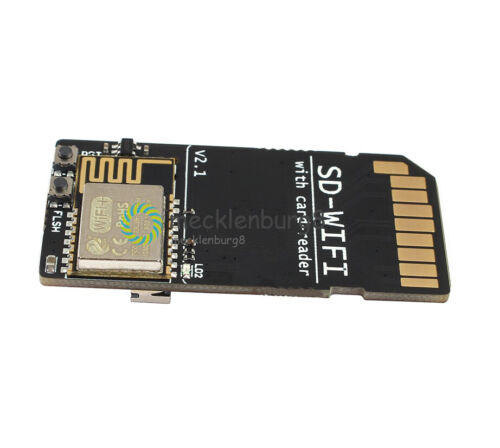

# WebDAV Server and a 3D Printer
This project is a WiFi WebDAV server using ESP8266 SoC. It maintains the filesystem on an SD card.

Supports the basic WebDav operations - *PROPFIND*, *GET*, *PUT*, *DELETE*, *MKCOL*, *MOVE* etc.

Once the WebDAV server is running on the ESP8266, a WebDAV client like Windows can access the filesystem on the SD card just like a cloud drive. The drive can also be mounted like a networked drive, and allows copying/pasting/deleting files on SD card remotely.

### 3D Printer

I am using this setup as a networked drive for 3D Printer running Marlin. Following circuit with ESP8266 and a MicroSD adapter is fabricated on a PCB. A full size SD card adapter is glued to one end and provides access to all SPI data lines from printer. ESP8266 code avoids accessing micro SD card, when Marlin (printer's firmware) is reading/writing to it (detected using Chip Select line).

GCode can be directly uploaded from the slicer (Cura) to this remote drive, thereby simplifying the workflow. 


## Dependencies:
1. [ESP8266 Arduino Core version 2.4](https://github.com/esp8266/Arduino)
2. [SdFat library](https://github.com/greiman/SdFat)
  

## Use:
Compile and upload the program to an ESP8266 module. ESP12-E was used for development and testing.
Connect the SPI bus lines to SD card.

ESP Module|SD Card
---|---
GPIO13|MOSI   
GPIO12|MISO   
GPIO14|SCK    
GPIO4|CS   
GPIO5|CS Sense   

The card should be formatted for Fat16 or Fat32

To access the drive from Windows, type ```\\esp_hostname_or_ip\DavWWWRoot``` at the Run prompt, or use Map Network Drive menu in Windows Explorer.

## References
Marlin Firmware - [http://marlinfw.org/](http://marlinfw.org/)   

Cura Slicer - [https://ultimaker.com/en/products/ultimaker-cura-software](https://ultimaker.com/en/products/ultimaker-cura-software)   

3D Printer LCD and SD Card Interface - [http://reprap.org/wiki/RepRapDiscount_Full_Graphic_Smart_Controller](http://reprap.org/wiki/RepRapDiscount_Full_Graphic_Smart_Controller)   

LCD Schematics - [http://reprap.org/mediawiki/images/7/79/LCD_connect_SCHDOC.pdf](http://reprap.org/mediawiki/images/7/79/LCD_connect_SCHDOC.pdf)   


## Das Video ist auf Youtube
[YouTube: SD Card + ESP8266 = OctoPrint Alternative?](https://www.youtube.com/watch?v=nHNZPRl8gzA&t=620s) bei 5:54 beschreibt `Thomas Sanladerer` das WiFi-Setup. 
Er verwendet dazu: [FYSETC/ESPWebDAV](https://github.com/FYSETC/ESPWebDAV) und dies stellt einen Clone vom Original [ardyesp/ESPWebDAV](https://github.com/ardyesp/ESPWebDAV) da.

Ab 6:20 min. beschreibt er, das er dazu (Pronterface)[https://www.google.com/search?q=pronterface+download&oq=Pronterface&aqs=chrome.1.69i57j0i512l9.3406j0j7&sourceid=chrome&ie=UTF-8] und dies ist eine (Pronterface: Printrun: Pure Python 3d printing host software)[https://www.pronterface.com/] verwendet. 
Für Pronteface gibt es eine weitere Beschreibung (Pronterface: How to Download, Install & Set It Up - All3DP)[https://all3dp.com/2/pronterface-how-to-download-install-and-set-it-up/].



[Ebay: SD-WIFI with Card-Reader Module ESP8266 USB to serial Wireless Transmission NEW](https://www.ebay.de/itm/265689753420?_trkparms=amclksrc%3DITM%26aid%3D777008%26algo%3DPERSONAL.TOPIC%26ao%3D1%26asc%3D20220822113838%26meid%3Dc43b115613e1420491e2ab98faffd084%26pid%3D101524%26rk%3D1%26rkt%3D1%26sd%3D122891034180%26itm%3D265689753420%26pmt%3D0%26noa%3D1%26pg%3D2380057%26algv%3DRecentlyViewedItemsV2%26brand%3DMarkenlos&_trksid=p2380057.c101524.m146925&_trkparms=pageci%3A42190337-7bd1-11ed-94b4-6a2cf1bac2ca%7Cparentrq%3A119783e41850aa702763a77dfff8a302%7Ciid%3A1)
Preis: EUR 16,64 (inkl. MwSt.)

.jpg)
[Ebay: SD-WIFI with Card-Reader Module ESP8266 USB to serial Wireless Transmission NEW](https://www.ebay.de/itm/234550269364?_trkparms=amclksrc%3DITM%26aid%3D777008%26algo%3DPERSONAL.TOPIC%26ao%3D1%26asc%3D20220822113838%26meid%3Dc43b115613e1420491e2ab98faffd084%26pid%3D101524%26rk%3D1%26rkt%3D1%26sd%3D122891034180%26itm%3D234550269364%26pmt%3D0%26noa%3D1%26pg%3D2380057%26algv%3DRecentlyViewedItemsV2%26brand%3DMarkenlos&_trksid=p2380057.c101524.m146925&_trkparms=pageci%3A42190337-7bd1-11ed-94b4-6a2cf1bac2ca%7Cparentrq%3A119783e41850aa702763a77dfff8a302%7Ciid%3A1)
Preis: EUR 16,79 (inkl. MwSt.)

Product Description
Introduction

The SD-WIFI is a module that can run ESPwebDev（https://github.com/ardyesp/ESPWebDAV）. We made it into the shape of an SD card so it can be directly inserted into an existing SD card slot and powered. You can connect it to the router using the serial command we provided, and then write down the returned IP address. Then, a WebDAV client like Windows can access the file system on the SD card like a cloud disk and allow remote replication / Paste / delete files on SD card. If you have used Flash-Air SD card for Toshiba, you should understand this method. But Flash-Air cannot be connected to the router because it is running as an AP, and only one device can be connected to it. For example, if your computer is connected to it, you can no longer connect to the Internet at the same time. However, our module is used as a client to access the LAN, and all devices in the network can access it without affecting the original connection.
 
Summary
 

Operating Voltage: 3.3V（Via SD Finger ）/5V（Via USB）
USB to serial chip: CH340E
Max Current: 600mA
Size: 49.5mm x 24mm
Feature

On-board SD card reader (for card reading via USB)
Onboard USB to serial chip (used for wifi configuration via serial port)
USB toggle switch (between card reader and serial chip)
3.3V 600mA LDO (used when WIFI module power supply is plugged in USB)
 
 
Package Included: 1pcs 